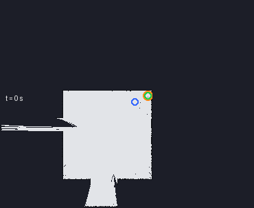

# ohm-nav-exploration

Frontier-based exploration for ROS 2, plus four reactive control demos that need no map and no planner. The
package reads the map somebody else is building, decides which unexplored place is worth driving to, hands that
place to nav2, and writes off the places that turned out to be unreachable. Mapping is slam_toolbox's job,
driving is nav2's, and the robot is the [mecanum-lab](../mecanum-lab) simulator as it is.



*Light is mapped free floor, dark navy is **unknown**, black is what the lidar says is there. The pink line is
the track the robot drove, the green triangle is the robot pointing where it is pointing, the blue rings are the
frontier clumps the node found, and the orange dot is the goal it took. The run behind it was 150 seconds in the
`rooms` hall: **19 goals taken, 7 arrived at, 6 dropped in favour of a bigger clump once the map showed more to
be seen, 2 refused outright** while nav2 was still coming up — which is what an exploration run actually looks
like. It is not a diagram: [`tools/record_view.py`](ohm_frontier/tools/record_view.py) recorded `/map`,
`/frontiers`, `/<robot>/odom` and `/tf` from a live run and drew them, the same four topics RViz reads. The
[last frame as a PNG](docs/images/exploration.png) if the animation will not play for you.*

## Requirements

| | what | why it is needed |
| --- | --- | --- |
| ROS 2 | **Jazzy (current LTS) or newer.** No command in this README asks for a distro by name. The measurements in `docs/` were taken on Kilted because that is what is on this machine, and one line of `config/nav2_rooms.yaml` (`enable_stamped_cmd_vel`) belongs to a particular generation of nav2 — on anything older, that is the first thing to look at if the view is right and the robot is not | the node, its messages, and `colcon` |
| ROS packages | `ros-$ROS_DISTRO-navigation2` `ros-$ROS_DISTRO-nav2-bringup` `ros-$ROS_DISTRO-slam-toolbox` `ros-$ROS_DISTRO-rviz2` | the planner, the mapper and the view. The four control demos need none of them |
| Python | 3.10+, `numpy`, `pytest`, `pygame` | `numpy` is the frontier rules; `pytest` is the tests; `pygame` is the simulator's window |
| The simulator | a `mecanum-lab` checkout, expected at `~/git/mecanum-lab` | there is no robot without it. Elsewhere: pass `sim_dir:=/path/to/mecanum-lab` |
| Message packages | `nav2_msgs`, `sensor_msgs`, `nav_msgs`, `visualization_msgs`, `tf2_ros` | all of them ship with the ROS packages above |
| For the tests | `Pillow` (`python3-pil`) | the recording tool's drawing half is tested, and that is the only place the package touches an image library |

One command says whether this machine has them — it tests the list rather than reciting it, and its exit code
names the class of thing that is missing:

```bash
./install.sh --check
```

It also names **which ROS 2 it looked at**, which matters more than it sounds: a machine with two distros in
`/opt/ros` is common, and the base install of one is not the same distro-with-nav2-on-it. This machine's own
check says `ROS 2 jazzy … rclpy importable` and then four `missing` lines asking for `ros-jazzy-slam-toolbox`
and friends — the nav2 set here lives in the other prefix. Read the name in the first line before you apt
anything.

If ROS is not already in your shell, source it first: `source /opt/ros/$ROS_DISTRO/setup.bash` (or name the
distro: `/opt/ros/jazzy/setup.bash`). The pip route for a machine where apt is not an option is
`./install.sh --pip` (`requirements.txt` explains what each line is for, and why ROS 2 itself is deliberately not
in it).

## Install and run

Three lines, from the repository root. The whole thing is one Python package, so the build is quick:

```bash
source /opt/ros/$ROS_DISTRO/setup.bash
colcon build --symlink-install && source install/setup.bash
ros2 launch ohm_frontier explore.launch.py
```

That starts five things: the simulator in the `rooms` hall with its window open, slam_toolbox mapping the lidar,
nav2's navigation servers, this package's view (`config/explore.rviz`), and the frontier node. The simulator is
never asked for its own view — two viewers with fixed frame `map` is one too many, and the one that loses shows
an empty map while the other is right.

After the first build, the last line is the whole command. Every launch below also takes `world:=`
(rooms | maze | open | arena | production | track), `robot:=carlo`, `headless:=true`, `rviz:=false`,
`nav2:=false` and `sim_dir:=`; `--show-args` has a sentence for each.

### The exploration runs

| command | what it is for |
| --- | --- |
| `ros2 launch ohm_frontier explore.launch.py` | the whole stack in `rooms`: mapping, planning, ranking, driving |
| `ros2 launch ohm_frontier explore_rooms.launch.py` | 22 × 16 m of walls **with doorways**, so every unentered room is one clump and the ranking has something to choose between |
| `ros2 launch ohm_frontier explore_open.launch.py` | 30 × 20 m with nothing but its boundary: one frontier, nothing to rank — the argument is what a frontier *is*. Run it first, `rooms` second |
| `ros2 launch ohm_frontier explore_maze.launch.py` | corridor one cell wide: a frontier is a corridor that ends, so the blacklist and `min_frontier_cells` are what is on display |
| `ros2 launch ohm_frontier explore_arena.launch.py` | a hall whose painted lanes reflect nothing back: the map is what the sensors say, not what the world file says |
| `ros2 launch ohm_frontier explore_no_nav2.launch.py` | no planner and no controller — the goals only on `/frontier_goal` and in the view, with nobody to blame but the ranking |
| `ros2 launch ohm_frontier frontier.launch.py` | this node alone, for when the rest is already running |

The view draws the ranking as geometry: a ring per candidate, a filled one on the goal, an arrow to it. The
arithmetic behind it is one word away, and off by default, because the text is 0.30 m tall and one sentence per
candidate (21 of them on a `rooms` map) is a cloud of words over the hall:

```bash
ros2 launch ohm_frontier explore.launch.py scores:=true
ros2 param set /frontier_node show_scores true        # the same, while it is driving
```

### The four control demos

One rule per file, no map, no planner, each drawing what it is deciding. The first two read the lidar, the last
two read odometry:

| command | the rule |
| --- | --- |
| `ros2 launch ohm_frontier reactive_wall_follow.launch.py` | find a wall, then hold it at `wall_distance` (0.50 m from the kinematic centre) |
| `ros2 launch ohm_frontier reactive_avoid.launch.py` | drive one way and get round whatever the 360 beams see, keeping a 0.40 m ring clear |
| `ros2 launch ohm_frontier reactive_turn_and_move.launch.py` | turn and drive at once, with a slip check against the odometry |
| `ros2 launch ohm_frontier move_to_point.launch.py` | turn first, then drive dead straight |

The last two take their place from outside, and their launch files publish one five seconds in so that the line
above moves the robot. `goal:=3.0,2.0` for another place, `goal:=` for none. To type one instead — the cheapest
way to watch a controller re-aim:

```bash
ros2 topic pub --once /muster/move_command std_msgs/msg/String "data: 'go 12.0 10.0'"
```

### Measure a run instead of squinting at it

```bash
ohm_frontier/tools/try_demo.sh reactive_wall_follow.launch.py muster 61 70 world:=rooms
```

One command: starts the stack headless on its own `ROS_DOMAIN_ID`, samples the odometry, the commanded `Twist`
and the lidar for 70 s, stops everything, and prints path against net displacement, how far the robot ever got
from where it started, the nearest echo and how often anything came inside the clearance margin. A robot that is
spinning in a corner and a robot that is exploring have the same state line and very different metres. The
numbers in **[docs/control-demos.md](docs/control-demos.md)** were made this way.

For the picture up top:

```bash
ros2 launch ohm_frontier explore_rooms.launch.py headless:=true rviz:=false      # one terminal
python3 ohm_frontier/tools/record_view.py muster 150 exploration.gif --every 1.5 --fps 10 --still exploration.png
```

## The tests

```bash
cd ohm_frontier && PYTEST_DISABLE_PLUGIN_AUTOLOAD=1 python3 -m pytest test -q
```

142 pass on this machine, and they need no robot and no hall: the frontier rules run on a grid made up in the
test file, and so do the reactive rules and the recorder's drawing.

**The environment variable is not decoration.** In a shell with ROS sourced, a plain `pytest test` dies before
it collects anything: recent ROS 2 distros advertise a `launch_testing` pytest plugin whose hook arguments a
pip-installed pytest ≥ 8 no longer accepts. The variable is the fix, it is what `./install.sh --check` prints,
and it looks exactly like a broken test suite when you have not met it before.

## Where the detail is

| page | what it holds |
| --- | --- |
| [docs/frontier-exploration.md](docs/frontier-exploration.md) | what a frontier is, why unknown is neither free nor occupied, how the three weights rank candidates, what happens when a goal cannot be reached, every parameter the node declares and what it stops, and Yamauchi's paper |
| [docs/control-demos.md](docs/control-demos.md) | the four reactive rules, the two dialects of a missing echo, mecanum against car, and the metres that say whether a rule drives or only moves |
| [docs/troubleshooting.md](docs/troubleshooting.md) | the view is perfect and the robot does not move; an empty map; no view at all; two runs on one machine; a hall file missing from an old build |
| [docs/verification.md](docs/verification.md) | what has been measured on this machine, how, and what is only asserted by a test |
| [INSTALL.md](INSTALL.md) | what `./install.sh --check` looks at, and what its exit codes mean |
